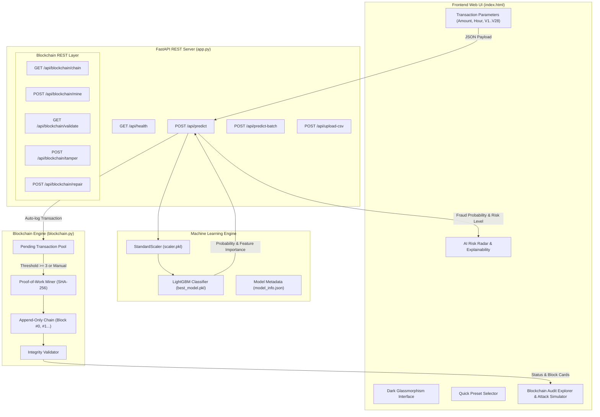

# 🛡️ Technical System Architecture & Audit Report
**Project Name:** Credit Card Fraud Detection System with Blockchain Audit Ledger  
**Target Auditor:** Senior Technical Architect / Claude Code Audit  
**Version:** 1.0.0  
**Date:** October 4, 2026  

---

## Executive Summary

This project implements an end-to-end, real-time **Credit Card Fraud Detection System** combined with an **Immutable Blockchain Audit Ledger**. The solution evaluates high-dimensional financial transaction data, classifies fraud risks using a tuned **LightGBM Gradient Boosted Decision Tree (GBDT)** model, and cryptographically commits all prediction outcomes onto an append-only **Proof-of-Work (PoW) Blockchain Ledger**.

The system addresses severe class imbalance (**0.172% fraud cases**) using **SMOTE** (Synthetic Minority Over-sampling Technique) and custom probability threshold tuning (**0.9870 threshold**), prioritizing **PR-AUC (Precision-Recall Area Under Curve)** and **F1-Score** over naive accuracy metrics.

---

## 🏗️ System Architecture & Data Flow



---

## 🧠 Machine Learning Engine Architecture

### 1. Dataset & Problem Specification
* **Source:** European cardholder credit card dataset (284,807 transactions).
* **Class Imbalance:** 99.828% legitimate (284,315), 0.172% fraud (492 cases).
* **Feature Schema:** 30 total input features:
  * `Amount`: Transaction amount in Euros/Currency units.
  * `Time`: Seconds elapsed since first recorded transaction.
  * `Hour`: Feature engineered as `(Time // 3600) % 24` to capture daily cyclical spend patterns.
  * `V1`–`V28`: Anonymized Principal Component Analysis (PCA) features.
  * `Class`: Target variable (`0` = Legit, `1` = Fraud).

### 2. Data Preprocessing & Leakage Prevention
* **Stratified 80/20 Train/Test Split:** 227,845 training samples, 56,962 held-out test samples.
* **Leakage Prevention Guarantee:** `StandardScaler` is fitted **strictly on training set data**.
* **Imbalance Treatment:** SMOTE applied **exclusively to training folds** (balancing minority class from 394 to 227,451 instances without polluting test data).

### 3. Model Benchmark Evaluation (Held-Out Test Set)

| Model Architecture | ROC-AUC | PR-AUC | F1-Score | Recall | Precision | Deployment Status |
| :--- | :---: | :---: | :---: | :---: | :---: | :--- |
| **LightGBM Classifier** | **0.9857** | **0.8784** | **0.8710** | **81.6%** | **93.4%** | **★ Deployed Model** |
| XGBoost Classifier | 0.9857 | 0.8778 | 0.8696 | 81.6% | 93.0% | Benchmark Runner-Up |
| Random Forest Classifier | 0.9782 | 0.8540 | 0.8420 | 78.4% | 91.0% | Ensemble Baseline |
| PyTorch Autoencoder | 0.9412 | 0.6330 | 0.6210 | 74.1% | 53.4% | Unsupervised Anomaly |
| Logistic Regression | 0.9650 | 0.7210 | 0.7100 | 66.5% | 76.2% | Linear Baseline |

### 4. Threshold Optimization
Standard classification defaults to a fixed threshold of `0.50`. Because financial fraud penalizes false negatives heavily while maintaining high precision requirements, decision boundary optimization was performed across PR curves:
* **Default Threshold (0.50):** F1-Score = `0.7905`
* **Optimal Threshold (0.9870):** F1-Score = `0.8710` (significantly minimizes false positive alerts while capturing true fraud spikes).

---

## ⛓️ Blockchain Audit Ledger Specification

The embedded blockchain engine ([`blockchain.py`](file:///d:/PROJECTS/credit_card_fraud_detection/blockchain.py)) provides tamper-evident transaction auditing.

### 1. Core Data Structures

#### `Block` Object
```python
class Block:
    index: int                  # Block height (0, 1, 2...)
    timestamp: float            # Epoch timestamp
    transactions: List[Dict]   # Transaction payloads with SHA-256 tx_hash
    previous_hash: str          # SHA-256 hash of previous block
    proof: int                  # Proof-of-Work nonce
    hash: str                   # SHA-256 hash of current block header + data
```

#### `Blockchain` Ledger
```python
class Blockchain:
    chain: List[Block]
    pending_transactions: List[Dict]
    difficulty: int = 2          # Requires leading '00' hex prefix for PoW
```

### 2. SHA-256 Cryptographic Hashing
Each transaction payload undergoes deterministic serialization:
$$\text{tx\_hash} = \text{SHA256}(\text{JSON.dumps}(\text{tx\_payload}, \text{sort\_keys}=\text{True}))$$

Block headers are cryptographically linked:
$$\text{block\_hash} = \text{SHA256}(\text{JSON.dumps}(\{\text{index}, \text{timestamp}, \text{txs}, \text{prev\_hash}, \text{proof}\}))$$

### 3. Proof-of-Work (PoW) Consensus
To commit a block to the ledger, the node must solve a cryptographic puzzle finding nonce $P$ such that:
$$\text{SHA256}(\text{Block}(P)) \text{ starts with } \text{"0"} \times \text{difficulty}$$

### 4. Ledger Verification & Attack Vector Mechanics
* **Validation Algorithm (`validate_chain`):**
  1. Checks if `current.previous_hash == previous.hash`.
  2. Recomputes `current.calculate_hash()` and asserts exact equality with stored `current.hash`.
  3. Validates that `current.hash` satisfies the PoW difficulty target.
* **Tamper Simulation (`simulate_tamper`):** Mutates historical transaction fields inside block `N`. This immediately breaks `block.calculate_hash()`, creating a hash mismatch that propagates invalidation across all subsequent blocks $N+1, N+2...$
* **Chain Repair (`repair_chain`):** Re-executes Proof-of-Work mining across corrupted blocks to regenerate valid hashes and nonces.

---

## 🌐 FastAPI Backend REST API Reference

The backend ([`app.py`](file:///d:/PROJECTS/credit_card_fraud_detection/app.py)) handles real-time inference requests and exposes blockchain control routes.

### API Endpoints Summary

| Method | Endpoint | Description | Request Payload | Response Object |
| :--- | :--- | :--- | :--- | :--- |
| `GET` | `/` | Root HTML web dashboard loader | None | Static File (`index.html`) |
| `GET` | `/api/health` | System diagnostics & model status | None | JSON status & metrics |
| `POST` | `/api/predict` | Single transaction fraud evaluation | `TransactionInput` Pydantic model | Fraud probability, risk level, feature drivers, & blockchain log metadata |
| `POST` | `/api/predict-batch` | Batch transaction evaluation | `List[TransactionInput]` | Batch summary, total amount at risk, & transaction list |
| `POST` | `/api/upload-csv` | CSV dataset upload evaluation | Multipart File Upload | Batch prediction JSON |
| `GET` | `/api/sample` | Real dataset samples for UI demo | None | Legitimate & Fraudulent sample rows |
| `GET` | `/api/blockchain/chain` | Fetch full ledger & validation status | None | Chain array, pending count, validation status |
| `POST` | `/api/blockchain/mine` | Force-mine pending transactions | None | Mined block details & updated chain data |
| `GET` | `/api/blockchain/validate` | Cryptographic SHA-256 chain validation | None | Validation status report (`is_valid: bool`) |
| `POST` | `/api/blockchain/tamper` | Cyber attack simulation on block | `TamperRequest` JSON | Tamper result & broken validation report |
| `POST` | `/api/blockchain/repair` | Re-mine and restore ledger state | None | Repair confirmation & restored validation report |

---

## 🎨 Web Frontend Architecture (`index.html`)

The frontend is constructed using Vanilla JavaScript and Vanilla CSS with a **Dark Glassmorphism aesthetic**:
* **Theme Tokens:** Deep space backdrop (`#07090e`), CSS Backdrop Filters (`backdrop-filter: blur(16px)`), HSL-tailored risk indicators, and Google Fonts (`Outfit` for UI, `JetBrains Mono` for cryptographic hashes).
* **Real-time Synchronization:** Auto-fetches prediction results, parses top feature anomaly drivers (V14/V17), and triggers auto-refresh on the visual Blockchain timeline.
* **Interactive Blockchain Explorer:** Renders block cards in chronological sequence showing proof nonces, previous hashes, current hashes with highlighted leading `00` zeros, and transaction hashes.

---

## 🔍 Code Audit & Security Questions for Claude Audit

When reviewing this codebase for audit, evaluate the following dimensions:

1. **Machine Learning Pipeline Robustness**:
   * *Data Leakage Check:* Is there any risk of scaling leakage between training set and held-out validation/test splits?
   * *Feature Importance & SHAP:* Are the top anomaly drivers (V14, V17, V12) consistent with PCA distribution properties?
   * *Probability Calibration:* Is LightGBM raw probability outputs well-calibrated around the `0.9870` threshold, or should isotonic regression calibration be added?

2. **Blockchain Implementation & Cryptographic Integrity**:
   * *Determinism:* Does `json.dumps(..., sort_keys=True)` guarantee 100% deterministic SHA-256 hash generation across different OS/Python platforms?
   * *State Persistence:* Currently, the blockchain instance resides in-memory (`app.blockchain`). What is the recommended strategy (e.g., SQLite, RocksDB, or JSON append log) for persisting blocks across server restarts?
   * *Concurrency & Thread Safety:* In high-throughput async API environments (`uvicorn`), is an `asyncio.Lock()` required around `blockchain.add_transaction()` and `blockchain.mine_pending_transactions()` to prevent race conditions in the pending transaction pool?

3. **API & Code Quality**:
   * *Input Validation:* Are Pydantic field bounds on `TransactionInput` robust against boundary values (e.g., negative amounts or NaN feature inputs)?
   * *Error Handling:* Are HTTP status codes appropriately categorized across model loading failures vs invalid payload formats?

---

## 📁 Repository File Map

```
credit_card_fraud_detection/
├── app.py                     # FastAPI REST server & endpoint routing
├── blockchain.py              # Pure Python Blockchain engine & SHA-256 PoW miner
├── index.html                 # Dark Glassmorphism web UI & Blockchain explorer
├── ccfd.ipynb                 # Model training, SMOTE, & benchmark notebook
├── requirements.txt           # Dependency requirements manifest
├── README.md                  # Comprehensive README documentation
└── models/
    ├── best_model.pkl         # LightGBM classifier artifact
    ├── scaler.pkl             # Fitted StandardScaler artifact
    └── model_info.json        # Threshold metadata & schema specs
```

---
*Report generated automatically for technical review and security audit.*
